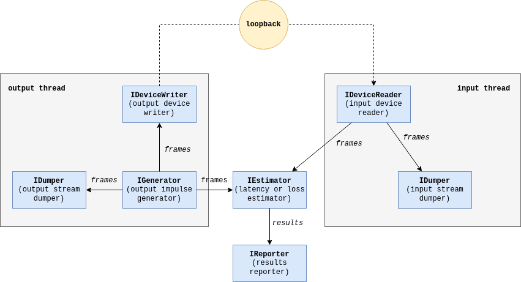
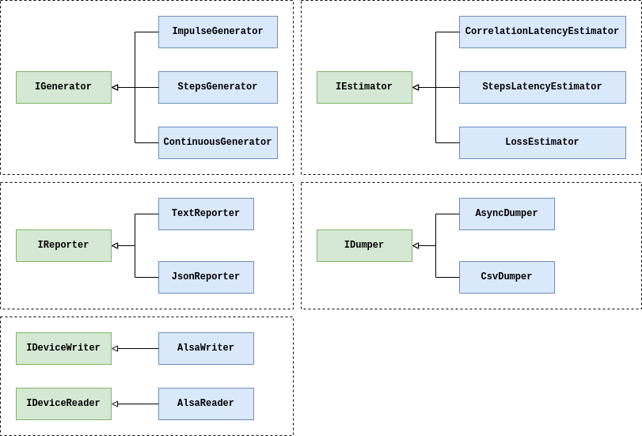

Signal Estimator
================

[](https://github.com/gavv/signal-estimator/actions)

<!-- toc -->

- [Features](#features)
- [Usage examples](#usage-examples)
- [Supported platforms](#supported-platforms)
- [Dependencies](#dependencies)
- [Installation](#installation)
- [Cross-compilation](#cross-compilation)
- [Graphical interface](#graphical-interface)
- [Command-line options](#command-line-options)
- [Measuring latency](#measuring-latency)
- [Measuring losses](#measuring-losses)
- [JSON output](#json-output)
- [Dumping streams](#dumping-streams)
- [ALSA parameters](#alsa-parameters)
- [Disabling PulseAudio](#disabling-pulseaudio)
- [Disabling PipeWire](#disabling-pipewire)
- [Real-time scheduling policy](#real-time-scheduling-policy)
- [Internals](#internals)
- [Acknowledgments](#acknowledgments)
- [Authors](#authors)
- [License](#license)

<!-- tocstop -->

Features
--------

`signal-estimator` is a small command-line and GUI tool allowing to measure different characteristics of the signal looped back from audio output to audio input.

Features:

* send test signal to output device and receive looped back signal from input device
* measure signal latency (the shift between output and input signal)
* measure signal loss ratio (number of glitches per second in the input signal)
* measurements output in JSON format for easy parsing
* dump output and input streams to text files and plot them using matplotlib

Usage examples
--------------

* **Measure hardware latency of sound card (by cable)**

   Connect computer audio output to its audio input using a jack cable.

   Measured loopback latency (bold red) will give you output + input latency of sound card.

   

* **Measure hardware latency of sound card (by air)**

   Place computer speakers near microphone.

   Measured loopback latency (bold red) will give you output + input latency of sound card + latency of spreading over air if distance is significant.

   

* **Measure hardware + software latency of Raspberry Pi soundcard loopback**

   Connect computer audio output to Raspberry Pi audio input using a jack cable. Connect Raspberry Pi audio output to computer audio input. On Raspberry Pi, run software that loops back signal from input to output device (e.g. snd-aloop).

   Measured loopback latency (bold red) will give you output + input latency of computer sound card (which you can measure separately and subtract) + output + input latency of Raspberry Pi sound card + latency of software running on Raspberry Pi.

   

* **Measure hardware + software + network latency of two Raspberry Pies connected via LAN**

   Connect computer audio output to audio input of first Raspberry Pi. Connect audio output of second Raspberry Pi to computer audio input. Run software that reads audio input on first Raspberry Pi, sends it to second Raspberry Pi, and writes to its audio output.

   Measured loopback latency (bold red) will give you output + input latency of computer sound card (which you can measure separately and subtract) + output + input latency of Raspberry Pi sound cards + latency of software running on Raspberry Pi + latency of network.

   

* **Measure hardware + software + bluetooth latency of mobile phone with Bluetooth headset**

   Place computer speakers near bluetooth microphone connected to a mobile phone. Place computer microphone near bluetooth headphones connected to the phone. Run a mobile app that loops back signal from bluetooth microphone to bluetooth headphones.

   Measured loopback latency (bold red) will give you output + input latency of computer sound card (which you can measure separately and subtract) + output + input latency of Bluetooth stack and software running on phone + latency of Bluetooth.

   

Supported platforms
-------------------

* Linux / ALSA

Dependencies
------------

External:

* C++17 compiler
* CMake >= 3.5
* libasound (ALSA devel)
* libpng (for GUI)
* Qt5 and Qwt (for GUI)

Vendored (git submodules):

* [concurrentqueue](https://github.com/cameron314/concurrentqueue)
* [cxxopts](https://github.com/jarro2783/cxxopts)
* [kissfft](https://github.com/mborgerding/kissfft)

Installation
------------

Install external dependencies:

```
sudo apt install libasound2-dev libpng-dev qtbase5-dev libqwt-qt5-dev
```

Clone repo with submodules:

```
git clone --recurse-submodules https://github.com/gavv/signal-estimator.git
cd signal-estimator
```

Build:

```
make
```

Build without GUI (in this case Qt and Qwt are not needed):

```
make no_gui
```

Executables are now placed into `bin/<toolchain>` directory, where `<toolchain>` is your host toolchain, e.g. `x86_64-linux-gnu`.

Install into the system (optionally):

```
sudo make install
```

Cross-compilation
-----------------

If you're using 32-bit or 64-bit Raspberry Pi, you can run:

```
make arm32
```

or:

```
make arm64
```

These commands require Docker. They will pull and run docker images with prebuilt toolchains compatible with Raspberry Pi, perform build, and place executables into `bin/arm-linux-gnueabihf` and `bin/aarch64-linux-gnu`, respectively.

To use your own toolchain instead of docker images, in simple cases it is enough just to specify `TOOLCHAIN_PREFIX` CMake option:

```
mkdir -p build/<toolchain>
cd build/<toolchain>
cmake -DBUILD_GUI=NO -DTOOLCHAIN_PREFIX=<toolchain> ../..
make
```

In example above, `<toolchain>` defines toolchain triple of the target system, e.g. `aarch64-linux-gnu`. In this case `aarch64-linux-gnu-gcc` and other tools should be available in `PATH`.

For more complicated cases, refer to [standard instructions](https://cmake.org/cmake/help/latest/manual/cmake-toolchains.7.html) for cross-compiling using CMake.

Graphical interface
-------------------

The tool comes with a simple GUI (`signal-estimator-gui`) that plots the signal in the real-time. It can be especially useful for troubleshooting problems with measurements.

It uses Qt and Qwt libraries. Internally, it invokes the command-line tool (`signal-estimator`) and parses its output.

Here is how it looks like:


Command-line options
--------------------

```
$ signal-estimator --help
Measure characteristics of a looped back signal
Usage:
  signal-estimator [OPTION...]

 General options:
  -h, --help          Print help message and exit
  -m, --mode arg      Mode: noop|latency_corr|latency_step|losses (default:
                      latency_corr)
  -o, --output arg    Output device name, required
  -i, --input arg     Input device name, required
  -d, --duration arg  Measurement duration, seconds (default: 10.000000)
  -w, --warmup arg    Warmup duration, seconds (default: 0.000000)

 I/O options:
  -r, --rate arg     Sample rate (default: 48000)
  -c, --chans arg    Number of channels (default: 2)
  -v, --volume arg   Signal volume, from 0 to 1 (default: 0.500000)
  -l, --latency arg  Ring buffer size, microseconds (default: 8000)
  -p, --periods arg  Number of periods in io ring buffer (default: 2)

 Reporting options:
  -f, --report-format arg  Output Format: text|json (default: text)
      --report-sma arg     Simple moving average window for latency reports
                           (default: 5)

 Dumping options:
      --dump-out arg          File to dump output stream (`-' for stdout)
      --dump-in arg           File to dump input stream (`-' for stdout)
      --dump-compression arg  Compress dumped samples by given ratio using
                              SMA (default: 64)

 Correlation-based latency estimation options:
      --impulse-period arg      Impulse period, seconds (default: 1.000000)
      --impulse-peak-noise-ratio arg
                                The peak-to-noise minimum ratio threshold
                                (default: 4.000000)
      --impulse-peak-window arg
                                Peak detection window length, in samples
                                (default: 128)

 Step-based latency estimation options:
      --step-period arg         Step period, seconds (default: 1.000000)
      --step-length arg         Step length, seconds (default: 0.100000)
      --step-detection-window arg
                                Step detection running maximum window, in
                                samples (default: 96)
      --step-detection-threshold arg
                                Step detection threshold, from 0 to 1
                                (default: 0.400000)

 Loss ratio estimation options:
      --signal-detection-window arg
                                Signal detection running maximum window, in
                                samples (default: 48)
      --signal-detection-threshold arg
                                Signal detection threshold, from 0 to 1
                                (default: 0.150000)
      --glitch-detection-window arg
                                Glitch detection running maximum window, in
                                samples (default: 32)
      --glitch-detection-threshold arg
                                Glitch detection threshold, from 0 to 1
                                (default: 0.050000)
```

Measuring latency
-----------------

There are two latency estimation modes:

* **Correlation-based latency estimation** (`--mode latency_corr`),
* **Step-based latency estimation** (`--mode latency_step`).

In both modes, the tool generates short periodic impulses and calculates the shift between each sent and received impulse.

In correlation mode, the tool generates M-sequence faded in and out with a Hamming window, and performs cross-correlation to match input and output. In step mode, the tool generates a step function and detects steps using a Schmitt trigger.

The correlation mode is known to provide improved precision and stability even under worse signal-to-noise ratio. The step mode, on the other hand, is much simpler and easier to verify, and so can be used as a baseline.


```
$ sudo signal-estimator -m latency_corr -o hw:0 -i hw:0 -d 5
opening alsa writer for device hw:0
suggested_latency: 8000 us
suggested_buffer_size: 384 samples
selected_buffer_time: 8000 us
selected_buffer_size: 384 samples
selected_period_time: 4000 us
selected_period_size: 192 samples
opening alsa reader for device hw:0
suggested_latency: 8000 us
suggested_buffer_size: 384 samples
selected_buffer_time: 8000 us
selected_buffer_size: 384 samples
selected_period_time: 4000 us
selected_period_size: 192 samples
successfully enabled real-time scheduling policy
successfully enabled real-time scheduling policy
successfully enabled real-time scheduling policy
latency:  sw+hw  10.688ms  hw   2.688ms  hw_avg5   2.688ms
latency:  sw+hw  10.237ms  hw   2.237ms  hw_avg5   2.462ms
latency:  sw+hw  11.231ms  hw   3.231ms  hw_avg5   2.719ms
latency:  sw+hw  10.776ms  hw   2.776ms  hw_avg5   2.733ms
latency:  sw+hw  11.299ms  hw   3.299ms  hw_avg5   2.846ms
```

Notation:

* `sw+hw` - total software + hardware latency, including ALSA ring buffer

  computed as the time interval beginning when the first audio *frame* of the impulse was sent to the output ring buffer, and ending when the first frame of the impulse was received from the input ring buffer

* `hw` - an estimation of hardware latency, excluding ALSA ring buffer

  computed as the time interval beginning when the first audio *sample* of the impulse was sent from ring buffer to the hardware, and ending when the first sample of the strike was received from the hardware and placed to ring buffer

* `hw_avg5` - moving average of last 5 `hw` values

`sw+hw` latency is affected by the `--latency` and `--periods` parameters, which defines the layout of ALSA ring buffer. You may need to select a higher latency if you're experiencing underruns or overruns.

`hw` latency, on the other hand, should not be affected by it and should depend only on your hardware and the way how the signal is looped back from output to input (e.g. if it's going by air, the distance will make a difference).

If you're having troubles, you may also need to configure signal volume, or impulse and step generation and detection parameters.

Measuring losses
----------------

In the loss estimation mode, the tool generates continuous beep and counts for glitches and gaps in the received signal.

```
$ sudo signal-estimator -m losses -o hw:0 -i hw:0 -d 5
opening alsa writer for device hw:0
suggested_latency: 8000 us
suggested_buffer_size: 384 samples
selected_buffer_time: 8000 us
selected_buffer_size: 384 samples
selected_period_time: 4000 us
selected_period_size: 192 samples
opening alsa reader for device hw:0
suggested_latency: 8000 us
suggested_buffer_size: 384 samples
selected_buffer_time: 8000 us
selected_buffer_size: 384 samples
selected_period_time: 4000 us
selected_period_size: 192 samples
successfully enabled real-time scheduling policy
successfully enabled real-time scheduling policy
losses:  rate   0.0/sec  rate_avg5   0.0/sec  ratio   0.00%
losses:  rate   6.0/sec  rate_avg5   3.0/sec  ratio   0.26%
losses:  rate   3.0/sec  rate_avg5   3.0/sec  ratio   0.20%
losses:  rate   0.0/sec  rate_avg5   2.3/sec  ratio   0.00%
losses:  rate   1.0/sec  rate_avg5   2.0/sec  ratio   0.01%
```

Notation:

* `rate` - rough estimation of the number of losses (glitches) per second

  a glitch is defined as a spike in the received signal gradient; we rely on the fact that the original signal is a smooth continuous sine wave

* `rate_avg5` - moving average of last 5 `rate` values

* `ratio` - rough estimation of the loss ratio (percentage of the lost frames)

  a loss is defined as a frame of the received signal, with all samples having small amplitude (volume); we rely on the fact that the original signal is a loud continuous sine wave

These numbers may be rough enough.

If you're having troubles, you may need to configure signal volume, and signal and glitch detection parameters.

JSON output
-----------

JSON output can be enabled by passing the `--report-format json` or `-f json` flag. By default, output is displayed in text format.

Sample JSON output format for measuring latency is shown below.

```
[
  {"sw_hw": 3.406247, "hw": 9.783531, "hw_avg5": 3.406247},
  {"sw_hw": 3.768061, "hw": 10.177324, "hw_avg5": 3.768061},
  {"sw_hw": 3.598191, "hw": 10.033534, "hw_avg5": 3.598191},
  {"sw_hw": 3.762508, "hw": 10.256863, "hw_avg5": 3.762508},
  {"sw_hw": 3.842750, "hw": 10.150537, "hw_avg5": 3.842750},
  {"sw_hw": 3.588736, "hw": 9.647981, "hw_avg5": 3.588736},
  {"sw_hw": 3.617144, "hw": 10.005338, "hw_avg5": 3.617144},
  {"sw_hw": 3.769689, "hw": 10.169054, "hw_avg5": 3.769689}
]
```

Sample JSON output format for measuring losses is shown below.

```
[
  {"rate": 0.000000, "rate_avg5": 0.000000, "ratio": 0.000000},
  {"rate": 0.000000, "rate_avg5": 0.000000, "ratio": 3.501563},
  {"rate": 0.000000, "rate_avg5": 0.000000, "ratio": 2.626626}
]
```

Note: Here `sw_hw` means `sw+hw` - total software + hardware latency, including ALSA ring buffer. All the notations are the same as mentioned in the measuring latency and losses section. All time units are in milliseconds.

Dumping streams
---------------

In any mode, including `noop` mode, you can specify `--dump-out` and `--dump-in` options to dump output and input samples and their timestamps to file or stdout (use `-`), in CSV format.

To reduce the file size, the tool can dump only one (average) value per frame of the size specified by `--dump-compression` option. This is enabled by default and can be disabled by setting this parameter to zero.

The timestamps in the dumped files correspond to the estimate time, in nanoseconds, when the sample was written to hardware or read from hardware.

```
$ sudo signal-estimator -m noop -o hw:0 -i hw:0 -d 5 \
    --volume 1.0 --dump-out output.csv --dump-in input.csv
...
```

The command above will produce two files:

```
$ ls -lh *.csv
-rw-r--r-- 1 user user  13K Jan 15 16:22 output.csv
-rw-r--r-- 1 user user 118K Jan 15 16:22 input.csv
```

We also provide a helper script that plots the files using matplotlib. You can use it to manually inspect the signal:

```
$ ./script/plot_csv.py output.csv input.csv
```


In this example we were measuring the latency of an Android phone with AirPods connected via Bluetooth, and the measured latency was about 238ms.

ALSA parameters
---------------

ALSA output and input device names are the same as passed to `aplay` and `arecord` tools.

You may need to configure sample rate and the number of channels. The selected values should be supported by both output and input devices.

You may also need to configure ALSA ring buffer size and the number of periods (I/O frames) in the ring buffer. These parameters affect software latency and output / input robustness.

Disabling PulseAudio
--------------------

If you're running a system with PulseAudio and need to use signal-estimator with hardware ALSA devices, you can temporary stop PulseAudio using:

```
systemctl --user stop pulseaudio.socket pulseaudio.service
```

Alternatively, you can set `autospawn` to `no` in `/etc/pulse/client.conf` and then run `pulseaudio --kill` or `killall -9 pulseaudio`.

Disabling PipeWire
------------------

If you're running a system with PipeWire and need to use signal-estimator with hardware ALSA devices, you can temporary stop PipeWire using:

```
systemctl --user stop pipewire pipewire.socket pipewire-pulse pipewire-pulse.socket
```

Real-time scheduling policy
---------------------------

If you run the tool under the `root` user, or with `CAP_SYS_NICE` and `CAP_SYS_ADMIN` capabilities, it will automatically enable `SCHED_RR` scheduling policy sensitive threads. This may help to avoid glitches introduced by the tool itself (not by the hardware or software being measured) on a loaded system and make the measurement more stable and precise.

Internals
---------

This diagram demonstrates the two main threads and data flow between them:



And this one shows interfaces and classes that implement them:



Acknowledgments
---------------

The development of this tool was heavily sponsored by Samuel Blum at Boring Technologies. Thanks a lot to him for letting the code to be open-sourced!

And of course, thanks to everyone who contributed to the project!

Authors
-------

See [here](AUTHORS).

License
-------

[MIT](LICENSE)
