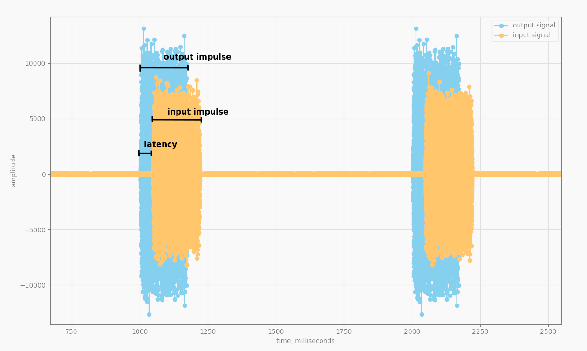

Signal Estimator
================

[](https://github.com/gavv/signal-estimator/actions)

<!-- toc -->

- [Features](#features)
- [Usage examples](#usage-examples)
- [Release history](#release-history)
- [Supported platforms](#supported-platforms)
- [Dependencies](#dependencies)
- [Installation](#installation)
- [Cross-compilation](#cross-compilation)
- [Graphical interface](#graphical-interface)
- [Command-line options](#command-line-options)
- [Measuring latency](#measuring-latency)
- [Measuring losses](#measuring-losses)
- [Measuring I/O jitter and delay](#measuring-io-jitter-and-delay)
- [Multiple input devices](#multiple-input-devices)
- [JSON output](#json-output)
- [Dumping streams](#dumping-streams)
- [ALSA parameters](#alsa-parameters)
- [Disabling PulseAudio](#disabling-pulseaudio)
- [Disabling PipeWire](#disabling-pipewire)
- [Real-time scheduling policy](#real-time-scheduling-policy)
- [Internals](#internals)
- [Acknowledgments](#acknowledgments)
- [Authors](#authors)
- [License](#license)

<!-- tocstop -->

Features
--------

`signal-estimator` is a small command-line and GUI tool allowing to measure different characteristics of the signal looped back from audio output to audio input.

Features:

* send test signal to output device and receive looped back signal from input device(s)
* measure signal latency (the shift between output and input signal)
* measure signal loss ratio (number of glitches per second in the input signal)
* measure I/O jitter and delay
* print reports in JSON format for easy parsing
* dump output and input streams in CSV format for later inspection

Usage examples
--------------

* **Measure hardware latency of sound card (by cable)**

   Connect audio output of PC to audio input using a jack cable.

   Measured loopback latency (bold red) will give you output + input latency of sound card.

   

* **Measure hardware latency of sound card (by air)**

   Place PC speakers near microphone.

   Measured loopback latency (bold red) will give you output + input latency of sound card + latency of spreading over air if distance is significant.

   

* **Measure hardware + software latency of loopback setup**

   Connect audio output of PC to audio input of DUT (Device Under Test, e.g. another computer) using a jack cable. Connect audio output of DUT to audio input of PC. On DUT, run software that loops back signal from input to output device.

   Measured loopback latency (bold red) will give you output + input latency of PC sound card (which you can measure separately and subtract) + output + input latency of DUT sound card (which you can also measure separately) + latency of software running on DUT.

   

* **Measure hardware + software + network latency of streaming setup**

   Connect audio output of PC to audio input of first DUT (Device Under Test, e.g. another computer). Connect audio output of second DUT to audio input of PC. Run software that reads audio input on first DUT, sends it to second DUT, and writes to its audio output.

   Measured loopback latency (bold red) will give you output + input latency of PC sound card (which you can measure separately and subtract) + output + input latency of DUT sound cards (which you can also measure separately) + latency of software running on DUTs + latency of network.

   

* **Measure hardware + software + bluetooth latency of mobile phone with Bluetooth headset**

   Place PC speakers near bluetooth microphone connected to a mobile phone. Place PC microphone near bluetooth headphones connected to the phone. Run a mobile app that loops back signal from bluetooth microphone to bluetooth headphones.

   Measured loopback latency (bold red) will give you output + input latency of PC sound card (which you can measure separately and subtract) + output + input latency of Bluetooth stack and software running on phone + latency of Bluetooth.

   

* **Measure synchronicity of two microphones**

   Place one speaker and two microphones in the same room, and connect all three to the PC. Run signal-estimator with one output and two input devices.

   Difference between measured latencies of the two inputs (bold red) will show how synchronous are the two microphones.

   

* **Measure synchronicity of streaming setup**

   Connect audio output of PC to audio input of sender DUT (Device Under Test, e.g. another computer). Connect audio outputs of two receiver DUTs to audio inputs of PC. On DUTs, run software that sends audio input to audio outputs over network. On PC, run signal-estimator with one output and two input devices.

   Difference between measured latencies of the two inputs (bold red) will show how synchronous are the two streams played on two receiver DUTs.

   

Release history
---------------

Changelog file can be found here: [changelog](CHANGES.md).

Supported platforms
-------------------

* Linux / ALSA

Dependencies
------------

External:

* C++17 compiler (GCC or Clang)
* CMake >= 3.5
* pkg-config
* libasound (ALSA devel)
* libpng (for GUI)
* Qt5 and Qwt (for GUI)

Downloaded automatically:

* [KISS FFT](https://github.com/mborgerding/kissfft)
* [concurrentqueue](https://github.com/cameron314/concurrentqueue)
* [intrusive_shared_ptr](https://github.com/gershnik/intrusive_shared_ptr)
* [{fmt}](https://github.com/fmtlib/fmt)
* [spdlog](https://github.com/gabime/spdlog)
* [CLI11](https://github.com/CLIUtils/CLI11)
* [GoogleTest](https://github.com/google/googletest)

Note: when cross-compiling, libasound (ALSA) is also downloaded automatically, so you don't need anything except toolchain.

Installation
------------

Install external dependencies:

```
sudo apt install g++ make cmake pkg-config libasound2-dev libpng-dev qtbase5-dev libqwt-qt5-dev
```

Clone repo:

```
git clone https://github.com/gavv/signal-estimator.git
cd signal-estimator
```

Build:

```
make
```

Build without GUI (in this case Qt and Qwt are not needed):

```
make no_gui
```

Run tests (optionally):

```
make test
```

Executables are now placed into `bin/<toolchain>` directory, where `<toolchain>` is your host toolchain, e.g. `x86_64-linux-gnu`.

Install into the system (optionally):

```
sudo make install
```

Cross-compilation
-----------------

If you're using 32-bit or 64-bit Raspberry Pi, you can run:

```
make arm32
```

or:

```
make arm64
```

These commands require Docker. They will pull and run docker images with prebuilt toolchains compatible with Raspberry Pi, perform build, and place executables into `bin/arm-linux-gnueabihf` and `bin/aarch64-linux-gnu`, respectively.

To use your own toolchain instead of docker images, in simple cases it is enough just to specify `TOOLCHAIN_PREFIX` CMake option:

```
mkdir -p build/<toolchain>
cd build/<toolchain>
cmake -DBUILD_GUI=NO -DTOOLCHAIN_PREFIX=<toolchain> ../..
make
```

In example above, `<toolchain>` defines toolchain triple of the target system, e.g. `aarch64-linux-gnu`. In this case `aarch64-linux-gnu-gcc` and other tools should be available in `PATH`.

For more complicated cases, refer to [standard instructions](https://cmake.org/cmake/help/latest/manual/cmake-toolchains.7.html) for cross-compiling using CMake.

Graphical interface
-------------------

The tool comes with a simple GUI (`signal-estimator-gui`) that plots the signal in the real-time. It can be especially useful for troubleshooting problems with measurements.

It uses Qt and Qwt libraries. Internally, it invokes the command-line tool (`signal-estimator`) and parses its output.

Here is how it looks like:


Command-line options
--------------------

<!-- help -->

```
$ signal-estimator --help
Measure characteristics of a looped back signal
Usage: signal-estimator [OPTIONS]

Options:
  -h,--help                   Print this help message and exit
  -L,--list-supported         Print supported features and exit
  -v,--verbose [0]            Increase verbosity level (can be used multiple times)

Control options:
  -m,--mode TEXT [latency_corr]
                              Operation mode: latency_corr|latency_step|losses|io_jitter|io_delay
  -o,--output TEXT            Output device name
  -i,--input TEXT ...         Input device name(s)
  -d,--duration FLOAT [0]     Limit measurement duration, seconds (zero for no limit)
  -w,--warmup FLOAT [1]       Warmup duration, seconds (zero for no warmup)

I/O options:
  -r,--rate UINT [48000]      Sample rate, Hz
  -c,--chans UINT [2]         Number of channels
  -g,--gain FLOAT [0.8]       Output signal gain, from 0 to 1
  --in-latency UINT [8000]    Input ring buffer size, microseconds
  --in-periods UINT [2]       Number of periods in input ring buffer
  --in-format TEXT [s16]      Input device sample format (see --list-supported)
  --out-latency UINT [8000]   Output ring buffer size, microseconds
  --out-periods UINT [2]      Number of periods in output ring buffer
  --out-format TEXT [s16]     Output device sample format (see --list-supported)
  --no-rt                     Don't try using SCHED_RR policy

Report options:
  -f,--report-format TEXT [text]
                              Report format: text|json
  --report-sma UINT [5]       Simple Moving Average window for latency reports

Dump options:
  -D,--dump-file TEXT         File to dump samples ("-" for stdout)
  --dump-compression UINT [0]
                              Compress dumped samples by given ratio using SMA

Correlation-based latency estimation options:
  --impulse-interval FLOAT [1]
                              Impulse interval, seconds
  --impulse-peak-noise-ratio FLOAT [4]
                              The peak-to-noise minimum ratio threshold
  --impulse-peak-window UINT [128]
                              Peak detection window length, samples

Step-based latency estimation options:
  --step-interval FLOAT [1]   Step interval, seconds
  --step-length FLOAT [0.1]   Step length, seconds
  --step-detection-window UINT [96]
                              Step detection running maximum window, samples
  --step-detection-threshold FLOAT [0.4]
                              Step detection threshold, from 0 to 1

Loss ratio estimation options:
  --signal-detection-window UINT [48]
                              Signal detection running maximum window, samples
  --signal-detection-threshold FLOAT [0.15]
                              Signal detection threshold, from 0 to 1
  --glitch-detection-window UINT [32]
                              Glitch detection running maximum window, samples
  --glitch-detection-threshold FLOAT [0.05]
                              Glitch detection threshold, from 0 to 1

I/O jitter estimation options:
  --io-jitter-window UINT [250]
                              I/O jitter detection window, number of periods
  --io-jitter-percentile UINT [95]
                              I/O jitter percentile, from 1 to 100

I/O delay estimation options:
  --io-delay-window UINT [250]
                              I/O delay detection window, number of periods
```

<!-- helpstop -->

Measuring latency
-----------------

There are two latency estimation modes:

* **Correlation-based latency estimation** (`--mode latency_corr`),
* **Step-based latency estimation** (`--mode latency_step`).

In both modes, the tool generates short periodic impulses and calculates the shift between each sent and received impulse.

In correlation mode, the tool generates M-sequence faded in and out with a Hamming window, and performs cross-correlation to match input and output. In step mode, the tool generates a step function and detects steps using a Schmitt trigger.

The correlation mode is known to provide improved precision and stability even under worse signal-to-noise ratio. The step mode, on the other hand, is much simpler and easier to verify, and so can be used as a baseline.

```
$ sudo signal-estimator -vv -m latency_corr -o hw:0 -i hw:0
[II] opening alsa writer for device hw:0
[DD] buffer_size: 8000 us (384 samples)
[DD] period_size: 4000 us (192 samples)
[DD] sample_rate: 48000 Hz
[DD] sample_format: s16
[DD] channel_count: 2
[II] opening alsa reader for device hw:0
[DD] buffer_size: 8000 us (384 samples)
[DD] period_size: 4000 us (192 samples)
[DD] sample_rate: 48000 Hz
[DD] sample_format: s16
[DD] channel_count: 2
[II] starting measurement
[DD] successfully enabled real-time scheduling policy
[DD] successfully enabled real-time scheduling policy
latency:  sw+hw  10.688ms  hw   2.688ms  hw_avg5   2.688ms
latency:  sw+hw  10.237ms  hw   2.237ms  hw_avg5   2.462ms
latency:  sw+hw  11.231ms  hw   3.231ms  hw_avg5   2.719ms
latency:  sw+hw  10.776ms  hw   2.776ms  hw_avg5   2.733ms
latency:  sw+hw  11.299ms  hw   3.299ms  hw_avg5   2.846ms
...
```

Notation:

* `sw+hw` - total software + hardware latency, including ALSA ring buffer

  computed as the time interval beginning when the impulse was written to the output ring buffer, and ending when the impulse was read from the input ring buffer

* `hw` - an estimation of hardware latency, i.e. excluding ALSA ring buffer

  computed as the time interval beginning when the impulse was sent from ring buffer to the hardware, and ending when the impulse was received from the hardware and placed into ring buffer

* `hw_avg5` - moving average of last 5 `hw` values (5 is configurable)

`sw+hw` latency is affected by ring buffer settings like `--out-latency` and `--out-periods`.

`hw` latency, on the other hand, should not be affected by ring buffer and should depend only on your hardware and the way how the signal is looped back from output to input (e.g. if it's going by air, the distance will make a difference).

If you observe underruns or overruns, you may need to increase ALSA period size or count, depending on your hardware. Depending on environment, you may also need to configure signal gain (`--gain`), and impulse/step interval and threshold (`--impulse-xxx` and `--step-xxx`).

Measuring losses
----------------

In the loss estimation mode, the tool generates continuous harmonic and counts for glitches and gaps in the received signal.

```
$ sudo signal-estimator -vv -m losses -o hw:0 -i hw:0
[II] opening alsa writer for device hw:0
[DD] buffer_size: 8000 us (384 samples)
[DD] period_size: 4000 us (192 samples)
[DD] sample_rate: 48000 Hz
[DD] sample_format: s16
[DD] channel_count: 2
[II] opening alsa reader for device hw:0
[DD] buffer_size: 8000 us (384 samples)
[DD] period_size: 4000 us (192 samples)
[DD] sample_rate: 48000 Hz
[DD] sample_format: s16
[DD] channel_count: 2
[II] starting measurement
[DD] successfully enabled real-time scheduling policy
[DD] successfully enabled real-time scheduling policy
losses:  rate   0.0/sec  rate_avg5   0.0/sec  ratio   0.00%
losses:  rate   6.0/sec  rate_avg5   3.0/sec  ratio   0.26%
losses:  rate   3.0/sec  rate_avg5   3.0/sec  ratio   0.20%
losses:  rate   0.0/sec  rate_avg5   2.3/sec  ratio   0.00%
losses:  rate   1.0/sec  rate_avg5   2.0/sec  ratio   0.01%
...
```

Notation:

* `rate` - rough estimation of the number of losses (glitches) per second

  a glitch is defined as a spike in the received signal gradient; we rely on the fact that the original signal is a smooth continuous sine wave

* `rate_avg5` - moving average of last 5 `rate` values

* `ratio` - rough estimation of the loss ratio (percentage of the lost frames)

  a loss is defined as a frame of the received signal, with all samples having small amplitude (volume); we rely on the fact that the original signal is a loud continuous sine wave

These numbers may be rather imprecise.

If you're having troubles, you may need to configure signal gain (`--gain`) and signal and glitch detection parameters (`--signal-xxx` and `--glitch-xxx`).

Measuring I/O jitter and delay
------------------------------

In **I/O jitter estimation mode**, the tool does not look at the signal itself, but instead measures jitter of I/O operations. This jitter defines how precisely ALSA and OS schedule I/O.

```
$ sudo signal-estimator -vv -o hw:0 -m io_jitter
[II] opening alsa reader for device hw:0
[DD] buffer_size: 8000 us (384 samples)
[DD] period_size: 4000 us (192 samples)
[DD] sample_rate: 48000 Hz
[DD] sample_format: s16
[DD] channel_count: 2
[II] starting measurement
[DD] successfully enabled real-time scheduling policy
io_jitter:  sw_avg   0.087ms  sw_p95   0.273ms  hw_avg   0.037ms  hw_p95   0.106ms
io_jitter:  sw_avg   0.107ms  sw_p95   0.274ms  hw_avg   0.050ms  hw_p95   0.136ms
io_jitter:  sw_avg   0.102ms  sw_p95   0.272ms  hw_avg   0.052ms  hw_p95   0.142ms
io_jitter:  sw_avg   0.125ms  sw_p95   0.329ms  hw_avg   0.043ms  hw_p95   0.121ms
io_jitter:  sw_avg   0.146ms  sw_p95   0.320ms  hw_avg   0.031ms  hw_p95   0.107ms
...
```

Notation:

* `sw_avg`, `sw_p95` - software timestamp jitter

    Deviation from period size of delta between software timestamps of subsequent frames. **Software timestamp** is the wallclock time when we wrote frame to ALSA ring buffer or read frame from it.

    `sw_avg` is average value, and `sw_p95` is 95th percentile (95 is configurable).

* `hw_avg`, `hw_p95` - hardware timestamp jitter

    Deviation from period size of delta between hardware timestamps of subsequent frames. **Hardware timestamp** is the estimation of wallclock time when the frame was sent from ALSA ring buffer to hardware, or received from hardware and placed into ring buffer.

    `hw_avg` is average value, and `hw_p95` is 95th percentile (95 is configurable).

**I/O delay estimation mode** is similar. The tool also does not look at the signal, but instead monitors software and hardware delays reported by ALSA.

```
$ sudo signal-estimator -vv -o hw:0 -m io_delay
[II] opening alsa reader for device hw:0
[DD] buffer_size: 8000 us (384 samples)
[DD] period_size: 4000 us (192 samples)
[DD] sample_rate: 48000 Hz
[DD] sample_format: s16
[DD] channel_count: 2
[II] starting measurement
[DD] successfully enabled real-time scheduling policy
io_delay:  sw_avg   6.696ms  hw_avg   0.783ms
io_delay:  sw_avg   6.675ms  hw_avg   0.760ms
io_delay:  sw_avg   6.701ms  hw_avg   0.824ms
io_delay:  sw_avg   6.682ms  hw_avg   0.822ms
io_delay:  sw_avg   6.739ms  hw_avg   0.823ms
...
```

Notation:

* `sw_avg` - average ring buffer size (software delay)

    Average value of ALSA ring buffer size, measured right after writing or reading frame.

    * For output devices, we try to keep the ring buffer full. The ideal buffer length would be the same as configured via `--out-latency` or `--in-latency` option.
    * For input devices, we try to keep the ring buffer empty. The ideal buffer length would be zero.

* `hw_avg` - average delay between ring buffer and ADC/DAC (hardware delay)

    Average value of delay introduced by link and codec, measured right after writing or reading frame. Hardware delay is reported by ALSA and is driver-dependent. Some drivers may report incomplete values (e.g. don't take codec into account) or even zero.

    Hardware delay is usually constant, but can be variable for some codecs. On USB cards, hardware delay may also depend on period size.

For more details about delays, see [ALSA documentation](https://www.kernel.org/doc/html/v4.10/sound/designs/timestamping.html). ALSA uses terms `avail` and `delay`, which maps to signal-estimator as follows:

* for input device: `software_delay = avail`
* for output device: `software_delay = buffer_size - avail`
* `hardware_delay = delay - software_delay`.

You can configure SMA and percentile parameters via `--io-jitter-xxx` and `--io-delay-xxx` options.

Multiple input devices
----------------------

It is possible to specify one output and multiple input devices. The tool assumes that the output reaches all inputs, and performs independent measurement for every input device.

```
$ sudo signal-estimator -v -o hw:0 -i hw:1 -i hw:2
[II] opening alsa writer for device hw:0
[II] opening alsa reader for device hw:1
[II] opening alsa reader for device hw:2
[II] starting measurement
latency[hw:1]:  sw+hw   9.704ms  hw   1.892ms  hw_avg5   1.892ms
latency[hw:2]:  sw+hw   9.680ms  hw   2.846ms  hw_avg5   2.846ms
latency[hw:1]:  sw+hw   8.990ms  hw   1.823ms  hw_avg5   1.858ms
latency[hw:2]:  sw+hw   9.837ms  hw   2.670ms  hw_avg5   2.758ms
latency[hw:1]:  sw+hw   8.942ms  hw   1.942ms  hw_avg5   1.886ms
latency[hw:2]:  sw+hw  10.038ms  hw   3.038ms  hw_avg5   2.852ms
latency[hw:1]:  sw+hw   8.914ms  hw   1.914ms  hw_avg5   1.893ms
latency[hw:2]:  sw+hw  10.330ms  hw   3.330ms  hw_avg5   2.971ms
...
```

JSON output
-----------

JSON output can be enabled by passing the `--report-format json` or `-f json` flag. By default, output is displayed in text format.

Sample JSON output format for measuring latency is shown below:

```
[
{"type": "latency", "device": "hw:0", "timestamp": 1698776522962310475, "sw_hw": 10.750376, "hw": 3.417044, "hw_avg": 3.417044},
{"type": "latency", "device": "hw:0", "timestamp": 1698776523970598047, "sw_hw": 10.784796, "hw": 3.451464, "hw_avg": 3.434254},
{"type": "latency", "device": "hw:0", "timestamp": 1698776524978383608, "sw_hw": 10.928465, "hw": 3.261799, "hw_avg": 3.376769},
{"type": "latency", "device": "hw:0", "timestamp": 1698776525985503559, "sw_hw": 10.681216, "hw": 3.347884, "hw_avg": 3.369548}
]
```

All the notations are the same as mentioned in the text reports. "timestamp" field defines report time in nanoseconds since Unix Epoch. Measured values are in milliseconds.

Dumping streams
---------------

In any mode, you can specify `--dump-file` option to dump output and input samples and their timestamps to file or stdout (use `-`), in CSV format.

To reduce the file size, the tool can dump only one (average) value per frame of the size specified by `--dump-compression` option (disabled by default).

The timestamps in the dumped files correspond to the estimate time, in nanoseconds since Unix Epoch, when the sample was written to hardware or read from hardware.

```
sudo signal-estimator -vv -m latency_step -o hw:0 -i hw:0 -d 5 --dump-file dump.csv
```

There is a helper script that plots the dump file using matplotlib. You can use it to manually inspect the signal:

```
./script/plot_dump.py [--device <device>] dump.csv
```



If dump includes multiple input devices, you should choose which one to display using `--device` option, e.g.:

```
./script/plot_dump.py --device hw:1 dump.csv
```

ALSA parameters
---------------

ALSA output and input device names are the same as passed to `aplay` and `arecord` tools.

You may need to configure sample rate (`--rate`) and the number of channels (`--chans`). Selected rate should be supported by both output and input devices.

You may also need to configure ALSA ring buffer size (`--out-latency` and `--in-latency`) and the number of periods (I/O frames) in the ring buffer (`--out-periods` and `--in-periods`). These parameters affect software latency and output / input robustness, but almost do not affect estimated hardware latency.

If there are glitches, you can try increasing buffer size and number of periods. Note that usually both of them should be multiple of power of two.

You can also configure which sample format to use (`--out-format` and `--in-format`), like `s16` or `s24_3le`. Usually signal-estimator automatically selects supported format, but you can specify preferred one if needed. Use `--list-supported` (`-L`) option to get list of all available formats.

Disabling PulseAudio
--------------------

If you're running a system with PulseAudio and need to use signal-estimator with hardware ALSA devices, you can temporary stop PulseAudio using:

```
systemctl --user stop pulseaudio.socket pulseaudio.service
```

Alternatively, you can set `autospawn` to `no` in `/etc/pulse/client.conf` and then run `pulseaudio --kill` or `killall -9 pulseaudio`.

Disabling PipeWire
------------------

If you're running a system with PipeWire and need to use signal-estimator with hardware ALSA devices, you can temporary stop PipeWire using:

```
systemctl --user stop pipewire pipewire.socket pipewire-pulse pipewire-pulse.socket
```

Real-time scheduling policy
---------------------------

If you run the tool under the `root` user, or with `CAP_SYS_NICE` and `CAP_SYS_ADMIN` capabilities, it will automatically try to enable `SCHED_RR` scheduling policy for sensitive threads. This may help to avoid glitches introduced by the tool itself (not by the hardware or software being measured) and make the measurement more stable and precise.

You can disable this behavior by providing `--no-rt` option.

Internals
---------

This diagram demonstrates the two main threads and data flow between them:


And this one shows interfaces and classes that implement them:


Acknowledgments
---------------

The development of this tool was heavily sponsored by Samuel Blum at Boring Technologies. Thanks a lot to him for letting the code to be open-sourced!

And of course, thanks to everyone who contributed to the project!

Authors
-------

See [here](AUTHORS.md).

License
-------

[MIT](LICENSE)
